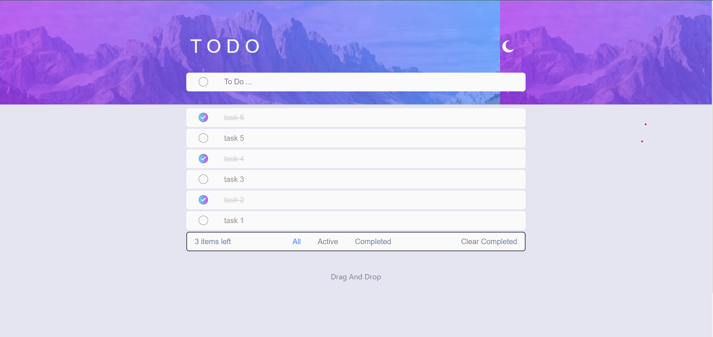
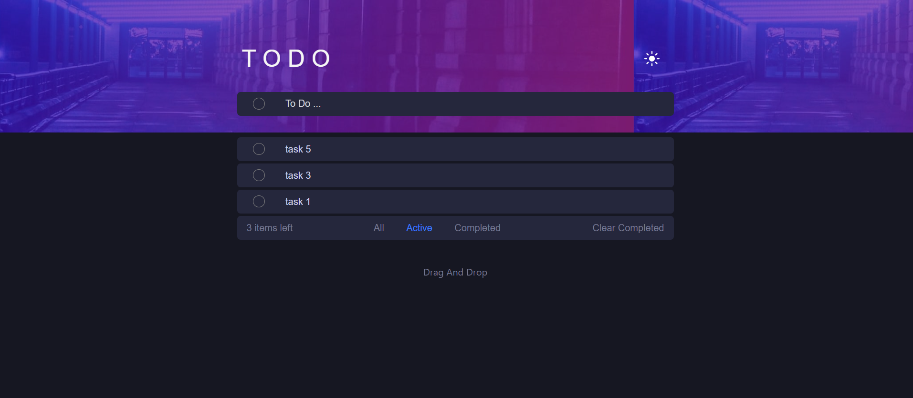

# Todo List Application

This is a responsive Todo List application challenge from [Frontend Mentor](https://www.frontendmentor.io), built to enhance frontend development skills. The app allows users to manage tasks efficiently with multiple features and provides an optimal user experience across devices.

## Features

- **Responsive Design**: The app adapts to different screen sizes, offering an optimal layout for mobile, tablet, and desktop devices.
- **Interactive Elements**: Hover states for all interactive elements enhance the user experience.
- **Add Todos**: Users can add new tasks to the list.
- **Mark as Complete**: Tasks can be marked as completed with a single click.
- **Delete Todos**: Users can delete individual tasks from the list.
- **Filter Tasks**: The app allows filtering by all, active, or completed tasks.
- **Clear Completed Tasks**: Users can clear all completed tasks in one go.
- **Dark/Light Mode**: A toggle allows users to switch between light and dark themes.
- **Drag and Drop (Bonus)**: Reorder tasks by dragging and dropping them in the desired order.

## Technologies Used

- **HTML5**: For the structure of the app.
- **CSS3 and Bootstrap**: For styling, including responsive layout and hover effects.
- **JavaScript**: For functionality such as adding, deleting, filtering, and reordering todos.
- **Frontend Mentor Challenge**: This project was built as part of the Frontend Mentor challenges, enhancing frontend development skills.

## How to Use

1. Clone the repository.
2. Open the `index.html` file in a browser to view and use the app.
3. Use the input field to add new tasks.
4. Use the checkboxes to mark tasks as complete.
5. Use the filters (All, Active, Completed) to view specific todos.
6. Use the "Clear Completed" button to remove all completed tasks.
7. Toggle between light and dark mode with the button.
8. Reorder todos by dragging and dropping them in the list.

## Project Setup

- Download or clone the project.
- Open the project folder.
- Open `index.html` in your browser.

## Preview

Here's a preview of the app showing the different modes and filters:

`Light mode and All task`

`Dark mode and Active task`

## Acknowledgements

This project was completed as part of a challenge by [Frontend Mentor](https://www.frontendmentor.io).
